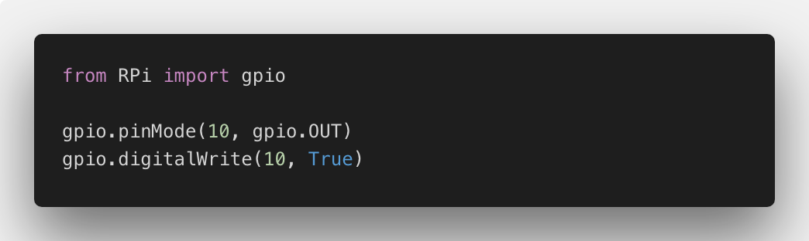

# RPi-Manage

A library in Python 3 to manage GPIOs in a Raspberry Pi 3 running OpenWRT

This library is intended to handle the GPIO pins in a Raspberry Pi in a similar way to Arduino IDE.




## How to install it

1. Download this repository
```
git clone https://github.com/Joaomlg/RPi-Manage.git
```

2. Inside the repository, run
```
python setup.py
```

3. Import to your code
```python
# Import RPi-Manage
from RPi import gpio

# Choose pin number
pin = 10

# Declare instance
gpio.pinMode(pin, gpio.OUT)

# Turn GPIO on
gpio.digitalWrite(pin, True)
```


## Available Commands

### Declare Pin
```python
# Pin 10 as Input
gpio.pinMode(10, gpio.IN)

# Pin 10 as Output
gpio.pinMode(10, gpio.OUT)
```

### Set State
```python
# Turn Pin 10 on
gpio.digitalWrite(10, True)

# Turn Pin 10 off
gpio.digitalWrite(10, False)
```

## Requirements

You need Python 3.6 or superior to run it.


## License

This project is distributed under the [MIT License](LICENSE).
